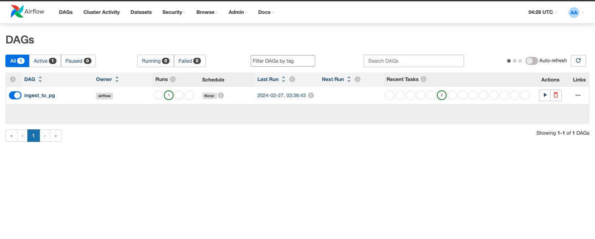
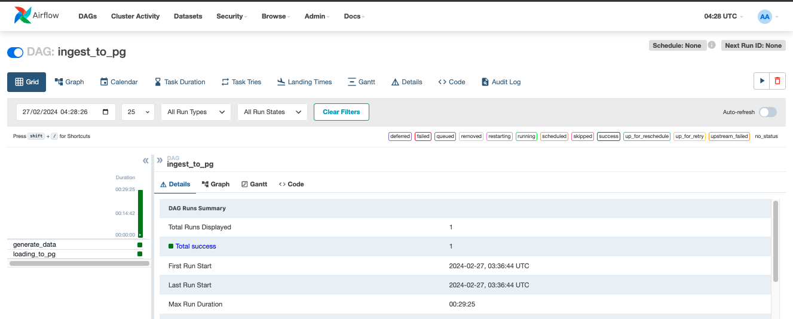

# Quick start
Follow these simple steps to quickly set up your data pipeline:

## Clone the Repository

Clone the repository containing the necessary files for the setup:

```bash
git clone https://github.com/natthakitnga/postgres-pipeline.git
```

## Run Docker Compose
```bash
docker-compose up --build
```


# Setting Up Data Pipeline with Airflow and Docker Compose

This guide will walk you through setting up a data pipeline to load data into PostgreSQL using Airflow running within Docker Compose. Both Airflow and PostgreSQL will be running inside Docker containers.

## Step 1: Pull Airflow Image 
pull airflow image latest version of Airflow (2.8.2) from Dockerhub [apache/airflow official](https://hub.docker.com/r/apache/airflow/tags)
```bash
docker pull apache/airflow:latest
```

## Step 2: Build custom airflow image

Write a Dockerfile to customize the Airflow image and add any additional requirements you need for your data pipeline.

```Dockerfile
# Use the official Airflow image as base
FROM apache/airflow:2.8.2

# Copy the requirements file into the container
COPY requirements.txt .

# Install any needed packages specified in requirements.txt
RUN pip install --no-cache-dir -r requirements.txt
```
Build the custom image and push it to Docker Hub:

```bash
docker build -t yourusername/airflow-custom:2.8.2 .
docker push yourusername/airflow-custom:2.8.2
```
## Step 3: Fetching docker-compose.yaml
fetching docker-compose.yaml from [airflow official document](https://airflow.apache.org/docs/apache-airflow/stable/howto/docker-compose/index.html) and adjust the file to use your custom Airflow image and add a PostgreSQL service.
```yaml
# change airflow image
x-airflow-common:
  &airflow-common
  image: your_custom_image

# add postgres service
  db_postgres:
    image: postgres:13
    environment:
      POSTGRES_USER: '${DB_POSTGRES_USER}'
      POSTGRES_PASSWORD: '${DB_POSTGRES_PASSWORD}'
      POSTGRES_DB: '${DB_POSTGRES_DATABASE}'
    ports: 
      - "5433:5432"
    volumes:
      - db-persist:/var/lib/postgresql/data
    healthcheck:
      test: ["CMD", "pg_isready", "-U", "${DB_POSTGRES_USER}"]
      interval: 5s
      retries: 5
    restart: always

# add volume postges use to persist data
volumes:
  postgres-db-volume:
  db-persist:
```
## Step 4: Start Docker Containers with Docker Compose
Run the following command to build and start the Docker containers using Docker Compose
```bash
docker-compose up --build
```

## Step 5: Add DAGs
Place your DAG files (e.g., ingest_to_bq.py) in the dags/ folder in the root directory of this project.

## Step 6: Access Airflow UI
Once the containers are up and running, you can access the Airflow web interface by visiting [localhost:8080](http://localhost:8080/) in your web browser.

The Airflow UI provides a dashboard where you can monitor your DAGs, view task status, and manage your workflow.

Make sure the Airflow containers are running and accessible before accessing the UI.


